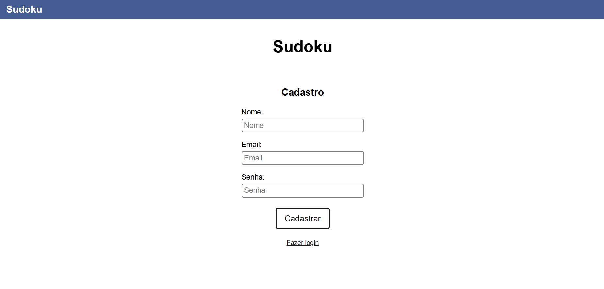
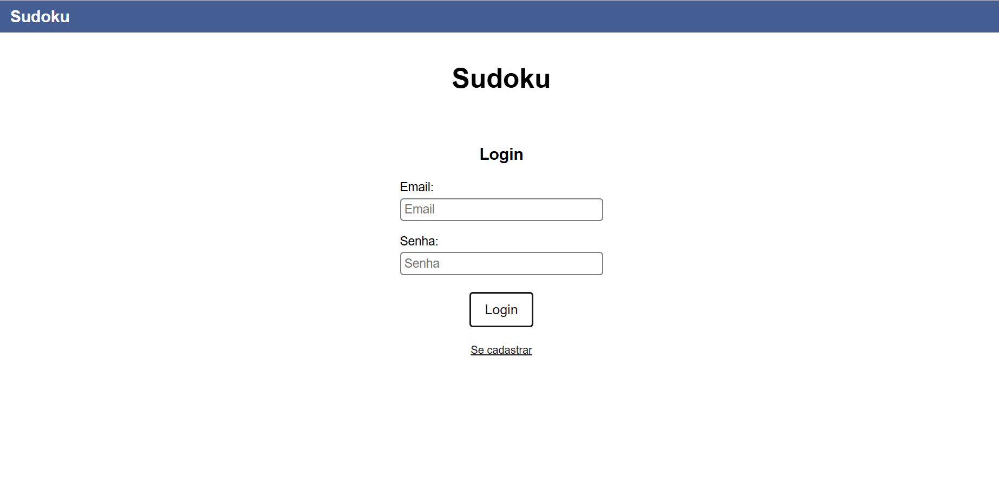
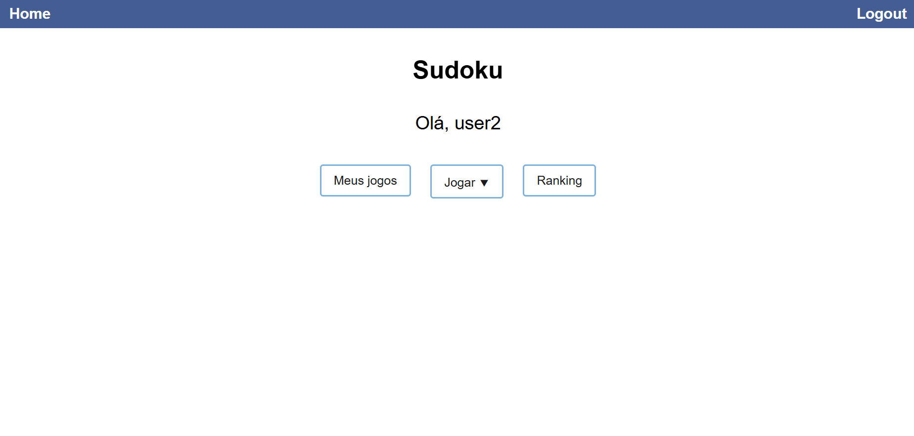
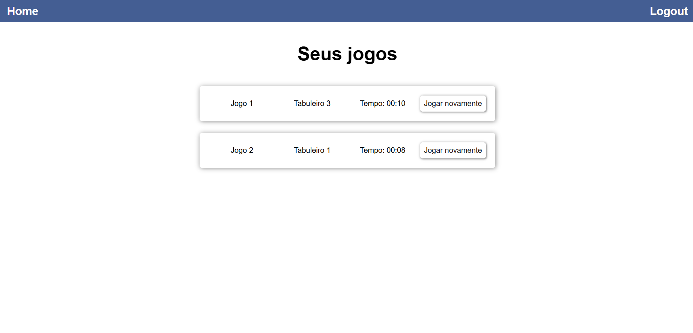
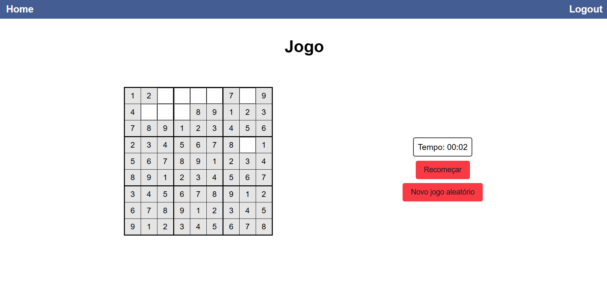
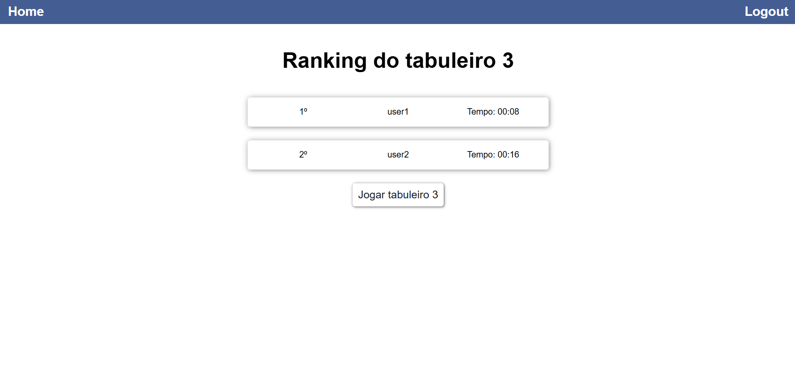

# Frontend

Interface do site para jogar sudokus

## Starting

- Inicie a API
- Instale as dependências da API
  ```
  cd sudoku/frontend
  npm i
  ```
- Rode o projeto: `npm run dev`, estará na porta 5173

## Rotas do site

### `/signup`

Página de cadastro


### `/login`

Página de login


### `/`

Home, é possível:

- ver "meus jogos"
- escolher um tabuleiro para jogar
- ver o ranking



### `/profile`

Página com uma lista dos jogos já completados


### `/game`

Página em que é possível jogar sudoku escolhido


### `/ranking`

Página com os 10 primeiros colocados de um tabuleiro

